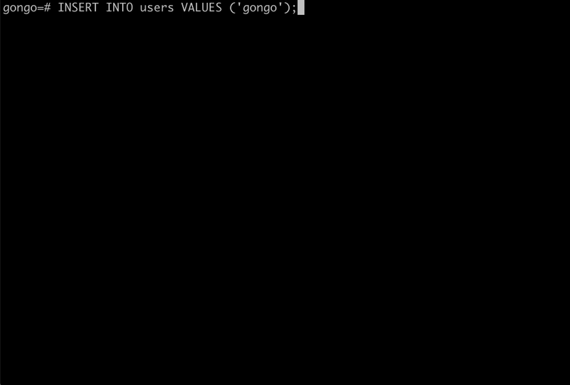

# plpgsql_workcat_upsert_yoshi

[workcat("仕事猫")](https://ja.wikipedia.org/wiki/%E4%BB%95%E4%BA%8B%E7%8C%AB) says "yoshi!" when inserted or updated.



## Installation

```sh-session
$ psql < workcat_upsert_yoshi.sql
```

## Usage

```sql
user=# CREATE TABLE users (name text);
user=# CREATE TRIGGER workcat_upsert_yoshi_trigger BEFORE INSERT OR UPDATE ON users FOR EACH ROW EXECUTE PROCEDURE workcat_upsert_yoshi();

user=# INSERT INTO users VALUES('gongo');
INFO:
              /＼  ／ヽ,
             {／￣￣￣ヽ!,
             ∠＿＿╋＿＿ｊ,
   yoshi!    / (.)八(.)  ヽ,
            ｛=/(人_)=|´￣)｀ヽ,
             ＼ { {_,ﾉ ﾉ   //~ `,
         ⊂￣ヽ_＞―――‐''’,〈 (＿),
          `ヘ(＿ ィ r―‐γ   !,
               _,ﾉ j   |   |,
             ｛   ｛    ﾉ  /＼,
              ＼ス￣￣￣lしｲ＼ ＼,
             (￣ ）     j /   ＼_j＼,
              ￣￣     ( ｀ヽ   ＼__)
                        ＼__ﾉ
INSERT 0 1
```

## License

[the Unlicense](https://unlicense.org/)
